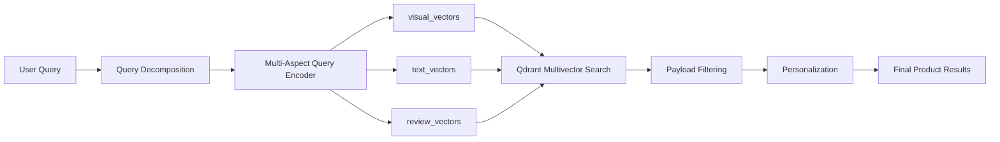

# Multi-Aspect E-Commerce Semantic Engine Using Qdrant Multivectors

## 1. Architecture Overview
This project stores one product as multiple semantic matrices inside one Qdrant point. A user query flows through query decomposition, aspect-specific encoders, Qdrant multivector retrieval, payload filtering, personalization, and final reranking.



## 2. Technology Choices and Justification
- Qdrant v1.15.3 is pinned because multivectors are available from v1.10, grouping from v1.11, formula query from v1.14, and binary/scalar quantization are supported in current releases.
- `qdrant-client>=1.14.2` is used because Qdrant's ColBERT reranking examples use this client range.
- FastEmbed `answerdotai/answerai-colbert-small-v1` creates 96-dimensional late-interaction token matrices.
- FastEmbed `BAAI/bge-small-en-v1.5` embeds extracted review findings into 384-dimensional semantic finding vectors.
- Hugging Face `google/vit-base-patch16-224-in21k` creates real ViT patch tokens; the code stores patch-level vectors rather than one pooled image vector.
- FastAPI and Typer expose the system through HTTP and CLI.

## 3. Project Structure
```text
src/commerce_engine/
  api.py              FastAPI endpoints
  benchmark.py        baseline/scalar/binary/HNSW benchmark runner
  cli.py              engine CLI
  embeddings.py       production and deterministic embedding backends
  filters.py          Qdrant payload filter builder
  fixtures.py         deterministic product catalog and users
  ingest.py           product-to-Qdrant point conversion
  qdrant_store.py     collection schema and verified Qdrant operations
  query.py            query decomposition and route planning
  reviews.py          semantic finding extraction
  scoring.py          MaxSim reference and personalization reranking
  updates.py          review/image append workflows
tests/                unit and API smoke tests
```

## 4. Data Model
Each product has identity, title, brand, category, price, availability, region, color, sizes, eco metadata, specs, reviews, and an image path. Payloads duplicate filterable fields so Qdrant can filter before scoring.

## 5. Qdrant Collection Design
The collection uses named multivectors:
- `visual_vectors`: size 768, cosine, `multivector_config.MAX_SIM`.
- `text_vectors`: size 96, cosine, `multivector_config.MAX_SIM`, HNSW disabled by default for reranking-style late interaction.
- `review_vectors`: size 384, cosine, `multivector_config.MAX_SIM`.

Payload indexes are created for `brand`, `category`, `region`, `color`, `size`, `product_id`, `availability`, `price`, and `eco_score`. Verified APIs used: `create_collection`, `create_payload_index`, `upsert`, `query_points`, `update_vectors`, `set_payload`, and `delete`.

## 6. Embedding Pipelines
- Visual pipeline: image -> ViT image processor -> `ViTModel.last_hidden_state` -> remove CLS token -> L2 normalize patch tokens -> store all patch vectors.
- Text/spec pipeline: title/spec text -> FastEmbed ColBERT -> token-level matrix -> store without pooling.
- Review pipeline: reviews -> semantic finding extraction -> BGE small embeddings per finding -> store as a matrix.

## 7. Implementation
Install and run locally:
```bash
uv sync --extra dev
cp .env.example .env
docker compose up -d qdrant
EMBEDDING_BACKEND=deterministic uv run engine init-qdrant
EMBEDDING_BACKEND=deterministic uv run engine ingest --fixtures
EMBEDDING_BACKEND=deterministic uv run engine search "Waterproof black hiking boots with good arch support" --user user_a
```
Use `EMBEDDING_BACKEND=production` for real FastEmbed and ViT model inference.

## 8. Search Flow
The query `Waterproof black hiking boots with good arch support` decomposes as:
- `waterproof` -> `text_vectors`
- `black hiking boots` -> `visual_vectors`
- `good arch support` -> `review_vectors`

Qdrant receives text and review `Prefetch` queries and uses the visual multivector query as the final stage. Payload filters are applied to every stage.

## 9. Personalization
Two users are included:
- `user_a`: prefers TrailForge/AlpinePro, lower price range, hiking boots.
- `user_b`: prefers EcoTrek, sustainable products, hiking boots.

The same Qdrant candidates are reranked deterministically with additive brand, price, eco, and category boosts. The response includes explanation strings for each boost.

## 10. Updates
`engine update-review` retrieves the existing point, extracts findings from the new review, embeds them, appends to `review_vectors`, and updates payload reviews with `set_payload`.

`engine update-image` retrieves the existing point, creates patch vectors for the new image, appends to `visual_vectors`, and calls `update_vectors`. No collection rebuild is required.

## 11. Optimization
`engine benchmark --profile scalar` recreates the collection with scalar INT8 quantization. `--profile binary` uses binary quantization. `--profile hnsw` keeps HNSW enabled for the text multivector field to compare against the reranking-oriented `m=0` setup.

Disabling HNSW for `text_vectors` saves index memory when ColBERT is used as a reranker over a smaller candidate set. The tradeoff is slower first-stage text-only retrieval if the collection grows and text vectors are queried directly.

## 12. Benchmarking
Run:
```bash
EMBEDDING_BACKEND=deterministic uv run engine benchmark --profile baseline
EMBEDDING_BACKEND=deterministic uv run engine benchmark --profile scalar
EMBEDDING_BACKEND=deterministic uv run engine benchmark --profile binary
EMBEDDING_BACKEND=deterministic uv run engine benchmark --profile hnsw
```
The benchmark reports mean latency, p95 latency, recall@3 over fixture queries, profile name, and estimated vector storage bytes after the selected quantization profile. In production, run with `EMBEDDING_BACKEND=production` after model downloads complete.

## 13. Dockerization
Start Qdrant only:
```bash
docker compose up -d qdrant
```
Start API and Qdrant:
```bash
docker compose up --build
```
The API listens on `http://localhost:8000`.

## 14. Testing
```bash
uv run ruff check .
uv run pytest
```
The default test suite avoids network/model downloads by using deterministic embeddings. Production smoke tests should run after dependencies and models are available.

## 15. Deployment
Set `QDRANT_URL`, `QDRANT_API_KEY`, `QDRANT_COLLECTION`, and `EMBEDDING_BACKEND=production`. Keep Qdrant storage persistent, monitor latency and recall, and pin model versions before client deployment.

## 16. README
This README intentionally follows the client-requested 17-section order. References verified during planning:
- Qdrant vectors/multivectors: https://qdrant.tech/documentation/manage-data/vectors/
- Qdrant hybrid queries and prefetch: https://qdrant.tech/documentation/search/hybrid-queries/
- Qdrant payload indexes: https://qdrant.tech/documentation/manage-data/indexing/
- Qdrant quantization: https://qdrant.tech/documentation/manage-data/quantization/
- FastEmbed ColBERT: https://qdrant.tech/documentation/fastembed/fastembed-colbert/
- Hugging Face ViT: https://huggingface.co/docs/transformers/model_doc/vit

## 17. Complete Source Code
The complete source code is in this repository under `src/commerce_engine` with tests under `tests`. No pseudo-code or placeholder functions are used; model-backed production paths load FastEmbed and Hugging Face models lazily at runtime, while deterministic embeddings exist for repeatable tests and offline smoke validation.
